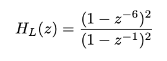
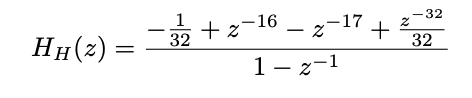
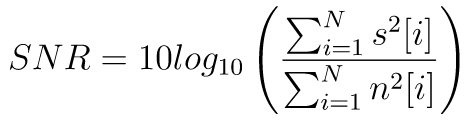

# Automatic QRS Complex Detection in Real-time

This project aims to apply signal processing techniques and tools to peform an analysis and automatic QRS complex detection on large duration ECG signals.

## Techniques

- Fast Fourier Transform
- Digital filters design
- Time-frequency analysis (i. e. Poles and zeros, Bode Diagram, Group Delay)

# Introduction

An ECG signal has intervals between different events which are called **segments**.
Each segment corresponds to the four different states the heart has when pumping blood.
Moreover, the signal has a few events called waves which are described next.

- **P wave**: Represents the depolarization of the atrium. Its duration is less than 100ms and its voltage
does not exceed 2.5 mV.

- **PR segment**: Shows the period of electrical inactivity corresponding to the physiological delay that
suffers the stimulus in the atrioventricular node. Its duration must be between 120 ms
and 200 ms.

- **QRS complex**: Represents the depolarization of the ventricles. It is formed by the Q waves,
R and S. This portion of the signal is the largest of the entire normal ECG. Its duration is of
80 to 100ms.

- **ST segment**: Comprised from the end of the QRS complex to the beginning of the T wave.

- **T wave**: Represents the repolarization of the ventricles.

- **QT segment**: Comprised from the beginning of the QRS complex to the end of the T wave and represents
depolarization and ventricular repolarization. Its duration will be between 320 and 400ms.

# Rubric

1. **Manual QRS complex detection**

Manually locate the QRS complexes and determine the segments that make up the wave.

2. **QRS Frequency characteristics**

Show the frequency characteristics of the QRS complex.

3. **ECG Spectrogram**

Perform an spectrogram of the electrocardiogram signal that allows visualizing the QRS wave frequency characteristics.
Implement the spectrogram to observe the frequency characteristics described in the previous point.

4. **ECG Noise**

Determine what type of noise is present in the ECG signal.
First, describe the stationary noises you find, using both time and frequency plots.
Then determine which portions of the ECG signal have added non-stationary noises. 
Explain possible sources for each noise.

5. **Low-pass Filter**

Obtain the pole diagram analytically and using MATLAB functions
and zeros, the frequency response and the impulse response of the low-pass filter proposed.
Calculate the delay produced by the filter.
Analyze causality, stability and the effect produced on the ECG signal.

6. **High-pass Filter**

Obtain the pole diagram analytically and using MATLAB functions
and zeros, the frequency response and the impulse response of the high-pass filter proposed.
Calculate the delay produced by the filter.
Analyze causality, stability and the effect produced on the output signal from the previous stage.
Also obtain the difference equation that characterizes the filter.

7. **FIR Filters**

Obtain FIR versions of the previous filters.
Discuss advantages and disadvantages
of both implementations.
The filters analyzed above are FIR filters even though their difference equation is recursive.
This is done in such a way as to represent a FIR filter with an IIR shape.
Plus specifically, these filters are called __FIR filters implemented as Tail-Canceling IIR filters__. 

8. **ECG derivative**

Obtain a discrete time LTI system and causal filter that allows you to approximate the derived from the ECG signal.
Justify for which frequencies this approach is valid based
in the frequency response of the system obtained.
Calculate the delay produced by the filter and obtain the derivative of the output signal from the previous stage.

9. **Squared Output**

Obtain the square of the output signal of the differentiation stage and show the effect produced in time and frequency.

10. **Integrator System Frequency Response**

Obtain the frequency response of the integrator system and analyze the delay generated By himself.
Adjust the value of N in order to highlight the temporal position of the complexes QRS.

11. **Automatic Detection**

Implement an automatic detection algorithm of QRS complexes
using the output signal of the preprocessing stage.
You can use the first minute of the signal to adjust the parameters of said algorithm.

12. **Gold Standard**

Use the Gold Standard algorithm, whose implementation is in the file
`qrs.m` detection, to perform automatic detection of QRS complexes from the signal output of the preprocessing stage.
Evaluate performance by counting the number of false positive and false negative.
A false positive is a brand that does not correspond to a complex
QRS This can also be taken as the erroneous insertion of a QRS complex brand. 
A false negative is not marking a QRS complex.
Use as a tolerance for the calculation of the error of
location the approximate width of the QRS complexes.

13. **Signal-to-noise Ratio**

Add white noise to the ECG signal to obtain signals with a signal relationship
at noise of `30 dB`, `20 dB` and `10 dB`, respectively.
Evaluate detector performance with these new signs.
The signal to noise ratio can be obtained as:

14. **Resampling**

Perform all previous processing but with resampled signals at 360 Hz
instead of 200 Hz.
Describe the discrete processing required to change the frequency of
sampling and determine the new form of the all the previous filters.
They meet the same processing requirements as in the case of the sampling frequency original.
